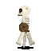
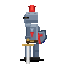
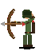
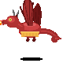
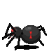
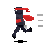
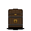

# 🔥 Sprite Forge

**Generate animated 2D game sprites from plain English — powered by [Claude Code](https://docs.anthropic.com/en/docs/claude-code).**

Describe a character, get a game-ready sprite sheet.

```
/sprite-forge dragon flying left, breathing fire
```

→ animated SVG → baked frames → PNG sprite sheet with mirror + metadata. Ready to drop into Unity, Godot, Phaser, LÖVE, or whatever engine you're using.

---

## 🎨 Showcase

Every sprite below was generated from a single text description. No art skills, no asset store, no subscription fees beyond Claude Code itself.

<table>
  <tr>
    <td align="center"><br/><sub><i>"skeleton warrior walking left"</i></sub></td>
    <td align="center"><br/><sub><i>"wizard casting a spell"</i></sub></td>
    <td align="center"><br/><sub><i>"slime bouncing"</i></sub></td>
    <td align="center"><br/><sub><i>"knight attacking with a sword"</i></sub></td>
    <td align="center"><br/><sub><i>"archer drawing a bow"</i></sub></td>
  </tr>
  <tr>
    <td align="center"><br/><sub><i>"dragon flying, breathing fire"</i></sub></td>
    <td align="center"><br/><sub><i>"spider crawling"</i></sub></td>
    <td align="center"><br/><sub><i>"ninja running with a kunai"</i></sub></td>
    <td align="center"><br/><sub><i>"treasure chest opening"</i></sub></td>
    <td align="center"><br/><sub><i>"fire elemental idle"</i></sub></td>
  </tr>
</table>

Each sprite is an 8-frame animation, rendered at 128×128 for the README but exported as a 64×64 PNG sprite sheet (plus mirrored version, plus JSON metadata, plus the animated GIFs above). Source SVGs are in [`showcase/`](showcase/) — tweak them freely and re-run the pipeline.

---

## 🚀 Install

```bash
curl -fsSL https://raw.githubusercontent.com/gididaf/sprite-forge/main/install.sh | bash
```

That's it. The installer sets up the CLI tool, the Claude Code skill, and all dependencies.

**Requirements:** [Claude Code](https://docs.anthropic.com/en/docs/claude-code), Python 3.10+, Pillow, librsvg. The install script handles the last three.

---

## ⚡ Quick start

Open Claude Code in any directory and type:

```
/sprite-forge goblin warrior with a club, walking left
```

Claude generates the SVG, runs the conversion pipeline, and hands you:

```
goblin_warrior_walk_left.svg                    ← animated source (editable)
goblin_warrior_walk_left_spritesheet.png        ← 8-frame horizontal strip
goblin_warrior_walk_left_spritesheet_mirror.png ← right-facing version
goblin_warrior_walk_left_spritesheet.json       ← frame data for your engine
```

The SVG is the source of truth — tweak it and re-run the pipeline anytime.

---

## 🔄 Iterate naturally

No flags to memorize. Just describe what you want.

```
/sprite-forge make the eyes glow red, modify skeleton_walk_left.svg
/sprite-forge now make it run, based on skeleton_walk_left.svg
/sprite-forge add a shield, based on skeleton_walk_left.svg
```

Claude reads the existing SVG, applies your change, and regenerates the sprite sheet. No re-prompting from scratch.

---

## 🛠 Standalone CLI

Already have an animated SVG? Convert it directly:

```bash
# Default: 8 frames, 64×64, with mirror + metadata
sprite-forge hero_walk_left.svg

# Higher resolution, more frames, with HTML preview
sprite-forge hero_walk_left.svg --frames 12 --size 128 --preview
```

### Options

| Flag | Default | Description |
|------|---------|-------------|
| `--frames N` | 8 | Number of animation frames |
| `--size N` | 64 | Frame size in pixels (square) |
| `--output PATH` | auto | Output PNG path |
| `--mirror` / `--no-mirror` | on | Generate flipped sprite sheet |
| `--meta` / `--no-meta` | on | Emit JSON metadata |
| `--preview` | off | Generate animated HTML preview |
| `--gif` | off | Generate animated GIF (great for READMEs / Discord / wikis) |
| `--keep-frames` | off | Keep individual frame PNGs |
| `--duration SECS` | auto | Override animation duration |

---

## 🧠 Why it works

Sprite Forge leans on Claude Code's native ability to generate SVG — no external APIs, no subscription on top of Claude Code, no training pipeline.

The pipeline:

1. **Parse** — read the SVG and auto-detect animation duration
2. **Bake** — sample `<animate>` / `<animateTransform>` values at N evenly-spaced time points, producing N static SVG snapshots
3. **Render** — rasterize each snapshot via `rsvg-convert`
4. **Stitch** — combine frames into a horizontal sprite sheet
5. **Mirror** — flip each frame individually (preserving per-frame geometry, unlike a blanket `scale(-1,1)` transform)
6. **Emit** — metadata JSON + optional animated HTML preview

The `/sprite-forge` skill bundles a visual review loop: Claude reads its own generated sprite sheet, grades it against a correctness spec, and iterates until it looks right (hard cap: 3 iterations). For subjects involving directional physics (archers, casters) it can spawn a fresh-eyes subagent reviewer to catch blind spots.

---

## 📐 SVG conventions

If you're hand-editing SVGs or extending the skill:

- **Facing**: side-view characters face LEFT — the pipeline mirrors for the right-facing version.
- **ViewBox**: `0 0 64 64` standard, `0 0 80 64` for wide characters (spiders, dragons).
- **Animation**: SMIL only (`<animate>`, `<animateTransform>`). CSS animations aren't baked.
- **Layering**: back limbs (darker) → body → front limbs for depth.
- **Body width in profile**: ≤ 7px — wider torsos read as front-facing regardless of head detail.
- **Limb thickness**: ≥ 5px — thinner disappears at 64×64.
- **Animation pitfalls**: keep rotation pivots constant across keyframes; don't nest more than one `additive="sum"` rotate per hierarchy branch (the frame baker doesn't resolve them cleanly).

---

## 🤝 Contributing

PRs welcome — especially new sprite archetypes for the showcase, or improvements to the baking engine. Keep SVGs small and hand-editable; no binary assets in the repo except the showcase PNGs.

## 📄 License

MIT
