# 🔥 Sprite Forge

**Generate animated 2D game sprites _and seamless tileable textures_ from plain English — powered by [Claude Code](https://docs.anthropic.com/en/docs/claude-code).**

Describe a character, get a game-ready sprite sheet. Describe a wall, get a seamless texture.

```
/sprite-forge dragon flying left, breathing fire
/sprite-forge a seamless mossy brick wall texture
```

→ animated SVG → baked frames → PNG sprite sheet + GIF + metadata, in any orientation (side-scroller, top-down, or a full directional set) — or a seamlessly-tiling Doom/Duke-3D-style surface texture at multiple power-of-two sizes. Ready to drop into Unity, Godot, Phaser, LÖVE, or whatever engine you're using.

---

## 🎨 Showcase

Every sprite below was generated from a single text description. No art skills, no asset store, no subscription fees beyond Claude Code itself.

<table>
  <tr>
    <td align="center">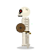<br/><sub><i>"skeleton warrior walking left"</i></sub></td>
    <td align="center"><br/><sub><i>"wizard casting a spell"</i></sub></td>
    <td align="center"><br/><sub><i>"slime bouncing"</i></sub></td>
    <td align="center">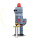<br/><sub><i>"knight attacking with a sword"</i></sub></td>
    <td align="center">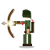<br/><sub><i>"archer drawing a bow"</i></sub></td>
  </tr>
  <tr>
    <td align="center">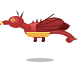<br/><sub><i>"dragon flying, breathing fire"</i></sub></td>
    <td align="center">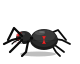<br/><sub><i>"spider crawling"</i></sub></td>
    <td align="center">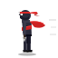<br/><sub><i>"ninja running with a kunai"</i></sub></td>
    <td align="center"><br/><sub><i>"treasure chest opening"</i></sub></td>
    <td align="center"><br/><sub><i>"fire elemental idle"</i></sub></td>
  </tr>
</table>

The sprites above are the *animated SVGs themselves*, rendered inline by your browser — no GIF conversion, no video player. Each source file is 1–3 KB, vector, infinitely scalable, and auto-plays without click-to-start controls. The pipeline also produces 64×64 PNG sprite sheets (JSON metadata, animated GIFs, and optional flipped/directional siblings via `--flip-to`) for game-engine import. Sources in [`showcase/`](showcase/) — tweak and re-run the pipeline.

---

## 🧱 Texture Showcase

Describe a surface, get a **seamlessly tileable** texture — Doom/Duke-3D-style walls and floors. Each image below is a **3×3 tiling** of one generated tile, so you can see the edges wrap with no seam. Every tile is built from edge-wrapped geometry and numerically seam-checked at bake time.

<table>
  <tr>
    <td align="center">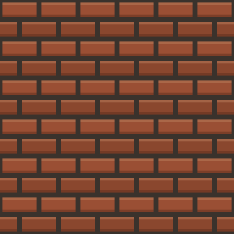<br/><sub><i>brick</i></sub></td>
    <td align="center">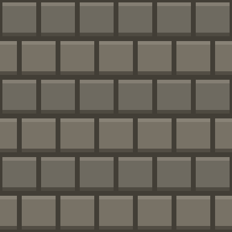<br/><sub><i>stone block</i></sub></td>
    <td align="center">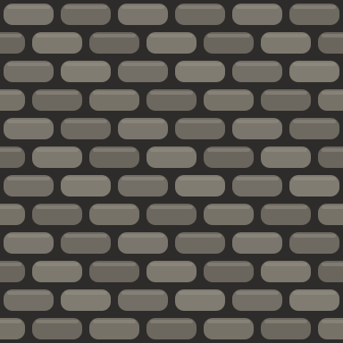<br/><sub><i>cobblestone</i></sub></td>
    <td align="center">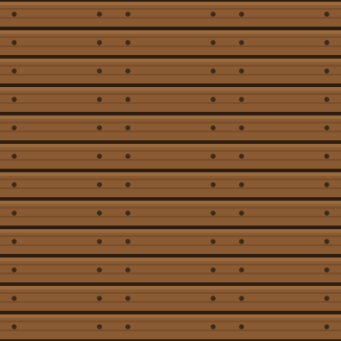<br/><sub><i>wood planks</i></sub></td>
  </tr>
  <tr>
    <td align="center">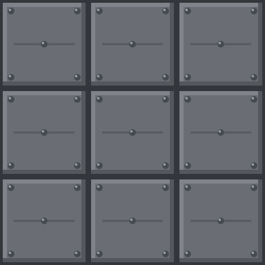<br/><sub><i>metal plate</i></sub></td>
    <td align="center">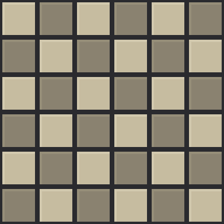<br/><sub><i>floor tiles</i></sub></td>
    <td align="center">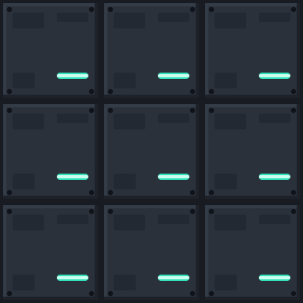<br/><sub><i>sci-fi panel</i></sub></td>
    <td align="center">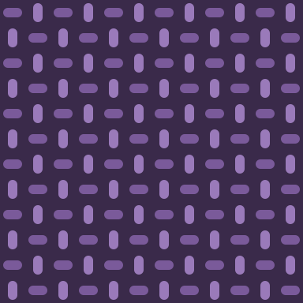<br/><sub><i>woven fabric</i></sub></td>
  </tr>
  <tr>
    <td align="center">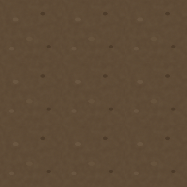<br/><sub><i>dirt ground</i></sub></td>
    <td align="center">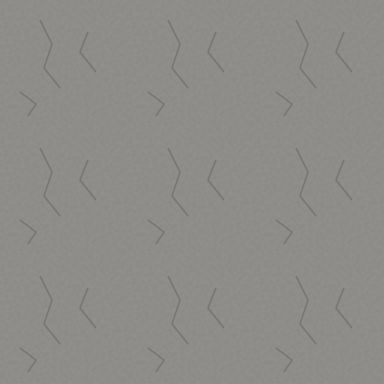<br/><sub><i>concrete</i></sub></td>
    <td align="center">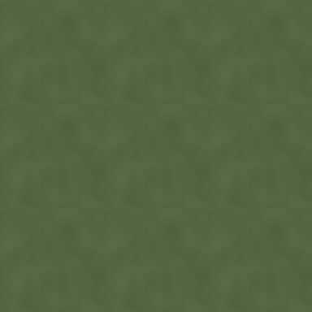<br/><sub><i>organic (moss/rust)</i></sub></td>
    <td align="center"></td>
  </tr>
</table>

**…and they animate.** Looping textures are seamless in *space* (edges wrap) **and** *time* (the loop returns to its start). These are 3×3 tilings, playing live:

<table>
  <tr>
    <td align="center">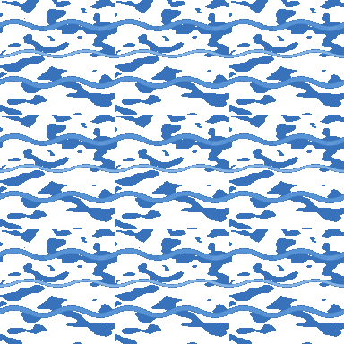<br/><sub><i>"flowing water, animated" — scrolling caustics</i></sub></td>
    <td align="center">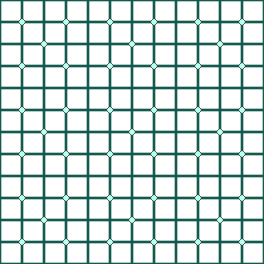<br/><sub><i>"energy barrier, animated" — pulsing (transparent decal)</i></sub></td>
  </tr>
</table>

Thirteen seam-correct starting templates ship with the skill, restyleable to any palette. Sources in [`showcase/textures/`](showcase/textures/). See the [Textures](#-textures) section below for how it works.

---

## 🚀 Install

```bash
curl -fsSL https://raw.githubusercontent.com/gididaf/sprite-forge/main/install.sh | bash
```

That's it. The installer sets up the CLI tool, the Claude Code skill, and all dependencies.

**Requirements:** [Claude Code](https://docs.anthropic.com/en/docs/claude-code), Python 3.10+, Pillow, librsvg. The install script handles the last three.

---

## ⚡ Quick start

Open Claude Code in any directory and type:

```
/sprite-forge goblin warrior with a club, walking left
```

Claude generates the SVG, runs the conversion pipeline, and hands you:

```
goblin_warrior_walk_left.svg              ← animated source (editable)
goblin_warrior_walk_left_spritesheet.png  ← 8-frame horizontal strip
goblin_warrior_walk_left.gif              ← animated preview
goblin_warrior_walk_left_spritesheet.json ← frame data for your engine
```

Need the right-facing version too? One render produces both:

```
goblin_warrior_walk_right_spritesheet.png ← flipped sibling via --flip-to
goblin_warrior_walk_right.gif
goblin_warrior_walk_right_spritesheet.json
```

The SVG is the source of truth — tweak it and re-run the pipeline anytime.

---

## 🔄 Iterate naturally

No flags to memorize. Just describe what you want.

```
/sprite-forge make the eyes glow red, modify skeleton_walk_left.svg
/sprite-forge now make it run, based on skeleton_walk_left.svg
/sprite-forge add a shield, based on skeleton_walk_left.svg
```

Claude reads the existing SVG, applies your change, and regenerates the sprite sheet. No re-prompting from scratch.

---

## 🧱 Textures

Sprite Forge also generates **seamlessly tileable surface textures** — the kind you'd wrap around a Duke Nukem 3D / Doom wall (see the [Texture Showcase](#-texture-showcase) above for the full gallery). Describe a material; get a tile that repeats with no visible seam, at multiple power-of-two sizes, plus a 3×3 verification grid.

```
/sprite-forge a worn brick wall, seamless texture
```

Thirteen seam-correct starting templates ship with the skill (brick, stone, cobblestone, wood, metal, tile, fabric, sci-fi panel, dirt, concrete, organic moss/rust/marble, plus animated water/lava and a force field), restyleable to any palette. Seamlessness is built from **edge-wrapped geometry** — the baker numerically self-checks every tile (`[seam] edge-wrap error mean=0.0 (seamless)`) so a broken wrap never slips through. Textures can be opaque walls/floors or transparent **decals** (grates, vines, cracks) that sit on top of another surface.

Each bake produces `<name>_64/128/256.png`, a `<name>_tilecheck.png` grid, and a `<name>_texture.json` for your engine.

### Animated textures

Textures can also **loop** — flowing water, bubbling lava, scrolling glow, a pulsing force field:

```
/sprite-forge a seamless flowing water texture, animated
```

An animated texture is seamless on **two axes**: *space* (edge-wrapped geometry, checked per frame) and *time* (a cyclic loop that returns to its start — the baker measures the loop and warns if it pops). `--tileable --animated` bakes a flipbook sprite sheet per size, a looping GIF, and an animated 3×3 seam-check (shown in the [Texture Showcase](#-texture-showcase) above).

---

## 🛠 Standalone CLI

Already have an animated SVG? Convert it directly:

```bash
# Default: 8 frames, 64×64, sprite sheet + GIF + metadata
sprite-forge hero_walk_left.svg

# Also emit a flipped right-facing sibling (sheet + gif + meta) in one render
sprite-forge hero_walk_left.svg --facing left --flip-to hero_walk_right

# Higher resolution, more frames, with HTML preview
sprite-forge hero_walk_left.svg --frames 12 --size 128 --preview

# Texture mode: seamless tile at 64/128/256 + a 3×3 seam-check grid
sprite-forge brick_wall_texture.svg --tileable --material brick
```

### Options

| Flag | Default | Description |
|------|---------|-------------|
| `--frames N` | 8 | Number of animation frames |
| `--size N` | 64 | Frame size in pixels (square) |
| `--output PATH` | auto | Output PNG path |
| `--flip-to NAME` | — | Emit a complete flipped sibling deliverable (sheet + gif + meta) named `NAME_*` — preferred for right-facing directions |
| `--facing LABEL` | — | Record facing (`left`, `down`, `up`, `downleft`, …) in the metadata |
| `--mirror` / `--no-mirror` | off | Generate a generic `_mirror.png` flipped sheet (legacy — prefer `--flip-to`) |
| `--meta` / `--no-meta` | on | Emit JSON metadata |
| `--gif` / `--no-gif` | on | Animated GIF (great for READMEs / Discord / wikis) |
| `--preview` | off | Generate animated HTML preview |
| `--silhouette` | off | Black-on-white silhouette of frame 0 (readability check) |
| `--keep-frames` | off | Keep individual frame PNGs |
| `--duration SECS` | auto | Override animation duration |

**Texture mode** (`--tileable`) renders a seamless surface instead of a sprite sheet:

| Flag | Default | Description |
|------|---------|-------------|
| `--tileable` | off | Texture mode — emit a seamlessly tiling surface (no sprite sheet, no facing) |
| `--sizes A,B,C` | `64,128,256` | Power-of-two sizes to emit (supersedes `--size`) |
| `--tile-grid N` | 3 | Emit an N×N seam-check grid PNG (`0` disables) |
| `--material NAME` | — | Material label recorded in the metadata |
| `--animated` | off | Bake a looping animated texture from the SVG's cyclic SMIL (flipbook sheet per size + GIF + animated seam-check) |

---

## 🧠 Why it works

Sprite Forge leans on Claude Code's native ability to generate SVG — no external APIs, no subscription on top of Claude Code, no training pipeline.

The pipeline:

1. **Parse** — read the SVG and auto-detect animation duration
2. **Bake** — sample `<animate>` / `<animateTransform>` values at N evenly-spaced time points, producing N static SVG snapshots
3. **Render** — rasterize each snapshot via `rsvg-convert`
4. **Stitch** — combine frames into a horizontal sprite sheet
5. **Flip** (`--flip-to`, optional) — flip each frame individually to derive the opposite-facing direction (preserving per-frame geometry, unlike a blanket `scale(-1,1)` transform)
6. **Emit** — metadata JSON + optional animated HTML preview

The `/sprite-forge` skill bundles a visual review loop: Claude reads its own generated sprite sheet, grades it against a correctness spec, and iterates until it looks right (hard cap: 3 iterations). For subjects involving directional physics (archers, casters) it can spawn a fresh-eyes subagent reviewer to catch blind spots.

---

## 📐 SVG conventions

If you're hand-editing SVGs or extending the skill:

- **Orientation**: the skill is orientation-aware — side-scroller (left/right), top-down 4-/8-way, or single/non-directional. Draw the non-flippable directions; derive the right-facing twins with `--flip-to`.
- **ViewBox**: `0 0 64 64` standard, `0 0 80 64` for wide characters (spiders, dragons).
- **Animation**: SMIL only (`<animate>`, `<animateTransform>`). CSS animations aren't baked.
- **Layering**: back limbs (darker) → body → front limbs for depth.
- **Body width in profile**: ≤ 7px — wider torsos read as front-facing regardless of head detail.
- **Limb thickness**: ≥ 5px — thinner disappears at 64×64.
- **Animation pitfalls**: keep rotation pivots constant across keyframes; don't nest more than one `additive="sum"` rotate per hierarchy branch (the frame baker doesn't resolve them cleanly).

---

## 🤝 Contributing

PRs welcome — especially new sprite archetypes for the showcase, or improvements to the baking engine. Keep SVGs small and hand-editable; no binary assets in the repo except the showcase PNGs.

## 📄 License

MIT
